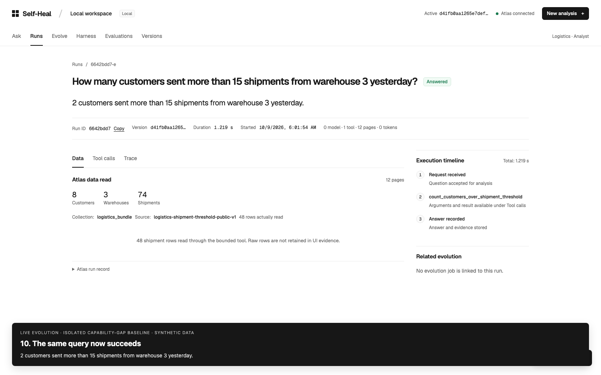
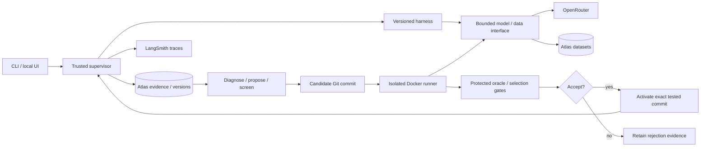

# Self-Heal

**An agent harness that turns failures into evaluations—and accepts changes only when the evidence supports them.**

Self-Heal is a Python prototype for improving an agent's tools and context policy while keeping its model, task contract, grader, and resource limits fixed. A trusted supervisor reproduces a limitation, freezes a test case, asks a model for a reusable harness patch, and evaluates the exact candidate commit before activation.

The core question: **did the agent gain a capability, or did it just learn to pass the example?**

[Demo](#narrated-demo) · [Quick start](#quick-start) · [Architecture](#architecture) · [Evaluation process](#evaluation-process) · [Setup guide](SETUP.md) · [Review guide](CONTRIBUTING.md)

## Narrated demo

[](docs/media/self-heal-demo.mp4)

[Watch the video · 1 minute 54 seconds](docs/media/self-heal-demo.mp4)

Follow the complete flow: capability failure → captured logs → proposed repair →
28 paired evaluation trials → activation → automatic rerun answering **2 customers**.
The demo uses live services on an intentionally limited, isolated baseline with
synthetic data. Waits are accelerated; narration and optional English captions are included.

## Why this is interesting

- **Failures become durable tests.** Wrong answers, exhausted budgets, exceptions, and explicit capability gaps retain their provenance and become regression evidence when independently gradable.
- **The agent cannot change its own grading rules.** Candidate edits are limited to `harness/`; the oracle, contracts, limits, and promotion logic stay in protected code.
- **Improvement is attributable.** Baseline and candidate use the same model, datasets, configuration, and Docker image. Comparisons pin commits and content hashes.
- **Selection and final assessment are separate.** Repeated validation feedback is development evidence. Untouched final cases are reserved before evolution and consumed once.
- **Every decision is inspectable.** Atlas links incidents, cases, diffs, trials, active versions, and rollback history; LangSmith supplies detailed redacted traces.

**Status:** implemented research prototype with local tests for the supervisor, bounded data interfaces, selection, promotion, rollback, and final-assessment controls. The original project notes report a live candidate rejected after 28 selection trials. A live recording on October 9, 2026 established a model-generated logistics repair in an isolated, intentionally limited baseline: 28 protected paired trials, accepted activation, and a successful automatic rerun. It uses synthetic data; an untouched final assessment has not been established. Those historical rejection records are not included in this clean source copy. The logistics capability is a reviewed code change, not evidence of autonomous evolution.

## Quick start

Run commands from the repository root. Requirements: **Python 3.11+**, **uv**, and **Git**. Live tasks also require **MongoDB Atlas** and **OpenRouter**. Evolution requires **Docker** and verified **LangSmith** tracing.

### 1. Install and verify without credentials

```sh
uv sync --frozen --extra dev
uv run --frozen pytest -q
uv run --frozen self-heal --help
```

The default suite uses scripted model replies and an in-memory MongoDB substitute. It needs no API keys or paid services. Three real-container tests are opt-in; see [Testing](#testing).

### 2. Configure live services

```sh
cp .env.example .env
```

Fill in `ATLAS_URI`, `OPENROUTER_API_KEY`, and `OPENROUTER_AGENT_MODEL` in the ignored `.env`. Use a tool-calling model available to your OpenRouter account. Keep `LANGSMITH_TRACING=false` for a basic task run, or configure its key and enable it for evolution. [SETUP.md](SETUP.md) explains every setting, service requirement, and common failure.

Use a **new database** for this copy. Stored active commits and run identities from the original repository do not belong to this fresh Git history. Live commands use model credits and write datasets/history to the configured database.

### 3. Ask an inventory question

```sh
uv run --frozen --env-file .env self-heal seed --fixture evals/analyst/data/small_inventory.json
uv run --frozen --env-file .env self-heal run --dataset small-inventory-v1 \
  --question "How many available units are in the East warehouse?"
```

Expected answer: **18 available units**. Add `--json` for outcome, interpreted task, resource counters, run ID, and evidence status. For a reproducible input, use `--task` instead of `--question`:

```sh
uv run --frozen --env-file .env self-heal run --dataset small-inventory-v1 \
  --task '{"metric":"available","filter_field":"warehouse","filter_value":"East"}'
```

### 4. Open the operator UI

```sh
uv run --frozen --env-file .env self-heal seed-logistics
uv run --frozen --env-file .env self-heal ui
```

Open [localhost:4173](http://127.0.0.1:4173). The UI includes Ask, Runs, Evaluations, and Versions, with bounded redacted row snapshots and linked execution evidence. The public logistics bundle contains 8 customers, 3 warehouses, and 74 shipments. Ask **“How many customers sent more than 15 shipments from warehouse 3 yesterday?”**; the reviewed tool returns **2**. `yesterday` refers to the fixture's synthetic time label.

The server defaults to loopback and is intended for local use. Seed inventory first if you want to switch sources. See [UI details](ui/README.md).

## Architecture



| Component                        | Responsibility                                                                                          |
| -------------------------------- | ------------------------------------------------------------------------------------------------------- |
| `harness/`                       | Editable agent loop, tools, and context policy; the candidate's only permitted edit surface             |
| `src/self_heal/`                 | Trusted orchestration, model/data access, telemetry, evolution, selection, promotion, and CLI/UI server |
| `evals/`                         | Protected deterministic generators, independent inventory/logistics oracles, and public fixtures        |
| `config/analyst.yaml`            | Task contracts, fixed resource budgets, evaluation thresholds, and edit scope                           |
| `runner_support/` + `Dockerfile` | Minimal container runtime with host-mediated model and data requests                                    |
| `prompts/`                       | Fixed scenario, diagnosis, and patch-generation instructions                                            |
| `ui/`                            | Dependency-free browser interface served by the local Python application                                |
| `tests/`                         | Scripted and mocked checks plus opt-in real Docker integration                                          |

Atlas stores immutable input data and compact improvement history. LangSmith stores redacted detailed traces; its trace ID links back to the Atlas run. Git pins the baseline and candidate source. The host owns credentials, the oracle, and authoritative resource counters.

Candidate containers have no network, run as a non-root user with a read-only filesystem, and receive the harness through a read-only mount. They receive neither the full repository nor database/provider credentials, expected answers, or private assessment manifests. Model and assigned-dataset requests go through the trusted host bridge. A Git worktree separates versions; Docker supplies the execution boundary. These controls have tests, but are not a proof of security against arbitrary hostile code.

[Detailed architecture and trust boundaries](docs/architecture.md)

## Evaluation process

### The theory: optimize behavior under an unchanged judge

Treat a harness revision as a hypothesis about a reusable mechanism: better aggregation, a new bounded tool, or better context selection. Hold the model and environment fixed, then test whether that mechanism improves exact task correctness within the same limits. This is source-level adaptation, not model-weight training.

The protected oracle computes the expected answer from the data independently of the generated tool. A candidate's explanation or self-reported success never establishes correctness. Faster execution or lower token use cannot compensate for an incorrect answer.

Adaptive search creates an overfitting risk: even hidden validation cases influence development once their pass/fail feedback is used to choose patches. Self-Heal tracks exposure and limits attempts, then uses a separate untouched assessment for the final claim. A few repeated LLM trials reveal variation; they do not establish statistical certainty or broad generalization.

The design draws on [RRSI: Regularized Recursive Self-Improvement of Agent Harnesses](https://arxiv.org/html/2609.24972v2), which studies how finite feedback can lead harness evolution to overfit. Self-Heal applies a bounded version of that concern through attributable edits, leakage screening, repeated trials, cost gates, and separate final assessment. It is not a reproduction of the paper's full algorithm or benchmark results.

### From incident to activation

1. **Observe and classify.** Record the task, dataset hash, source/model/config identities, independent counters, and trace. Distinguish unsupported requests from incorrect answers, budget exhaustion, and external failures.
2. **Establish ground truth.** Validate the task contract and calculate an independent expected answer. Out-of-contract requests remain capability gaps until a reviewed contract, data interface, and oracle exist.
3. **Reproduce and freeze.** Replay the baseline on the original task and an incident-derived generated case. Both must reproduce the limitation before proposing a patch; retain frozen datasets and case identities.
4. **Propose and screen.** Give the evolution model redacted evidence and editable harness source. Screen its unified diff for edit scope and task-specific leakage, then pin a candidate commit.
5. **Compare under fixed conditions.** Run baseline and candidate against original, generated, regression, private-validation, and unrelated-refusal cases. Use fresh cursors and counters with the same dataset, model, config, and image identities. Retain every trial.
6. **Apply all gates.** Require exact correctness, preserved regressions/refusals, repeated success on critical cases, complete evidence, and bounded resource use. Reject a candidate that misses any gate.
7. **Activate conditionally.** Promote only the exact tested commit, provided the active parent and environment still match. Fresh runs use the accepted version; retained versions support rollback.
8. **Assess once on untouched cases.** Freeze the selected harness and consume reserved final cases. Record correctness, resources, and failures separately from selection.

| Evaluation role       | What it establishes                                           | How to interpret it                                      |
| --------------------- | ------------------------------------------------------------- | -------------------------------------------------------- |
| Original reproduction | The failure exists and the candidate resolves it              | Disclosed development evidence; retained as regression   |
| Existing regressions  | Previously working behavior still works                       | Necessary protection against narrow fixes                |
| Fresh validation      | Transfer to variations within the declared task family        | Selection evidence; repeated feedback can overfit        |
| Final assessment      | Performance of the frozen selected version on untouched tasks | One-use assessment; report failures as well as successes |

Default configuration: **3 patch attempts**, **4 validation cases**, **2 live repetitions**, **2× maximum cost ratio**, and **required verified traces**. Runs are bounded by **8 model calls**, **12 tool calls**, **30,000 tokens**, **90 seconds**, **4 rows per page**, **256 pages**, and **1 MB of table data**. See the configuration and [evaluation design](docs/evaluation.md) for exact gate semantics.

### Reproduce the baseline checks

```sh
uv run --frozen --env-file .env self-heal eval materialize
uv run --frozen --env-file .env self-heal eval run --scenario small-east-available
uv run --frozen --env-file .env self-heal eval run --scenario bulk-warehouse-available
uv run --frozen --env-file .env self-heal eval logistics
```

The small inventory case must pass. The 512-row grouped stress case is intentionally beyond the base loop's model-call budget and declares `model_call_budget_exhausted` as its expected baseline outcome. **Exit code 0 means the baseline expectation matched, not necessarily that the task was answered correctly.** Inspect `baseline_expectation_matched`, outcome, and violations in the JSON. Invalid-row cases are checked locally and skipped during Atlas materialization.

### Run an evolution experiment

Enable LangSmith tracing, set `OPENROUTER_EVOLUTION_MODEL`, start Docker, and keep the source tree clean and committed. This review repository starts with a clean source commit; commit any later reviewed source edits before evolution.

```sh
uv run --frozen --env-file .env self-heal runner build
# Reserve untouched cases BEFORE exposing evolution to selection feedback.
uv run --frozen --env-file .env self-heal final reserve --manifest /tmp/self-heal-final-review.json
# Use the run ID of an actual completed, reproducible limitation.
uv run --frozen --env-file .env self-heal evolve --run-id <incident-run-id>
uv run --frozen --env-file .env self-heal history active
# Assess only after a candidate has passed selection and become active.
uv run --frozen --env-file .env self-heal final assess --manifest /tmp/self-heal-final-review.json
uv run --frozen --env-file .env self-heal history lineage --run-id <incident-run-id>
uv run --frozen --env-file .env self-heal history final
```

Use a new manifest path for each reservation and keep it outside the checkout. It contains private case references, is created with owner-only permissions, and must never be shared with the proposer. `final-` datasets are excluded from candidate selection and ordinary UI dataset selection. Each final case is claimed before execution; a failed case is consumed too. If final feedback guides a later patch, reserve new untouched cases for a later final claim.

Rollback records a reason and checks the current active commit:

```sh
uv run --frozen --env-file .env self-heal rollback \
  --expected-active <active-commit> --commit <retained-prior-commit> --reason "reviewed regression"
```

## Testing

```sh
uv run --frozen pytest -q
```

Tests cover oracle/generator behavior, immutable data, scoped reads, resource accounting, telemetry redaction, patch screening, comparative trials, promotion and rollback, final-case consumption, workflows, and the local UI. Scripted checks validate control flow; they do not prove live model reliability or real container isolation.

To exercise the real Docker boundary, start Docker and run:

```sh
uv run --frozen self-heal runner build
SELF_HEAL_DOCKER_TEST=1 uv run --frozen pytest -q tests/test_runner.py
```

A minimal GitHub Actions workflow runs the default suite on Python 3.11 and 3.12 without service credentials.

## Review and scope

Start with [the review guide](CONTRIBUTING.md), then inspect `config/analyst.yaml`, the independent oracles, `controller.py`, `evaluation.py`, `promotion.py`, and `final_assessment.py`. Evaluate **the acceptance boundary and evidence lineage**, alongside the agent's answers.

The current domains are bounded inventory totals and shipment/customer thresholds. A successful fixture answer does not establish cross-domain generalization. This copy includes source and synthetic fixtures; private service records, credentials, cached outputs, internal build plans, and historical demo recordings are excluded.

Licensed under [MIT](LICENSE).
