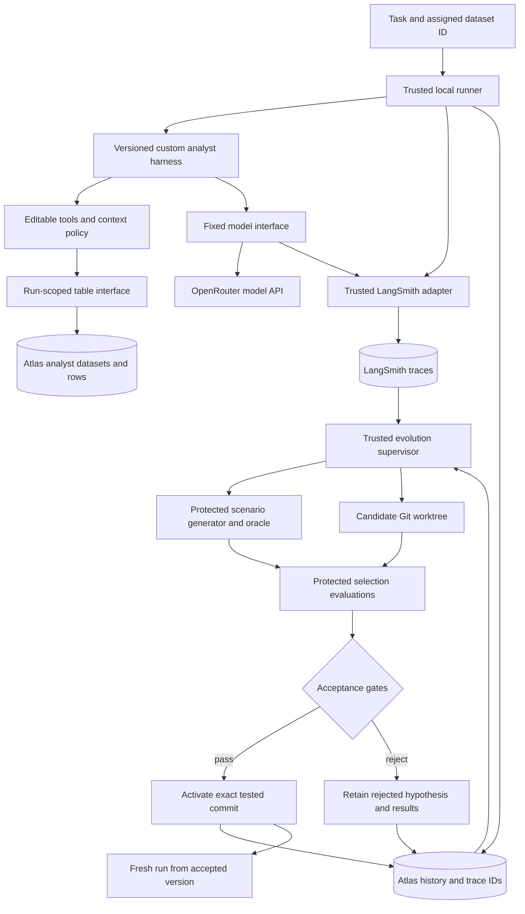
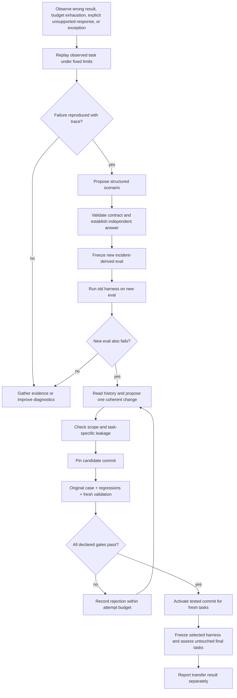

# Architecture

Self-Heal is one local application containing a custom analyst harness and a trusted supervisor. The harness evolves in response to task evidence; the supervisor runs separately so it can evaluate and start a new version without modifying an in-flight process.

**Implementation status:** Phases 1–5 are implemented and locally tested. Incident diagnosis, model-proposed harness diffs, immutable selection plans, Docker execution, protected scoring, conditional activation, and rollback now exist. The operator UI and CLI use the active commit for new runs. Final-assessment reserve, exclusion, consumption, and lineage controls are implemented and tested. A complete live model-generated promotion followed by untouched final assessment has not yet been verified. Historical live records are not included in this source copy.

## Components

The supervisor processes a task observation directly. A distributed queue, database change stream, remote deployment service, and generic framework adapters are not prerequisites. Atlas is the runtime source of immutable analyst tables as well as improvement state and trace references; LangSmith holds detailed execution traces. Neither service executes the harness or generates patches.

## Editable harness and protected infrastructure

| Area | Responsibility | Candidate may edit? |
| --- | --- | --- |
| `harness/agent.py` | Small model/tool loop using the fixed runtime interface | Yes |
| `harness/tools.py` | Tool implementations, descriptions, and registration | Yes |
| `harness/context.py` | Instructions, selected evidence, and tool-result context policy | Yes |
| `config/analyst.yaml` | Task contract, edit scope, fixed comparison settings, resource limits | No |
| `src/self_heal/table_store.py` | Trusted Atlas dataset materialization and run-scoped, bounded table reads | No |
| `src/self_heal/` | Supervisor, model access, thin LangSmith integration, Atlas storage, runner, evaluation coordination, promotion | No |
| `evals/analyst/` | Dataset definitions, fixture generator, reference calculation, disclosed development scenarios; actual table rows are materialized in Atlas | No |
| `tests/` and `prompts/` | Supervisor checks and fixed improvement instructions | No |

The first useful evolution is a generated reusable analysis tool and its supporting context policy. The proposer receives the editable source, runtime contract, relevant traces, disclosed eval evidence, and prior hypotheses. It does not receive private validation/final data, reference answers, or authority to change acceptance rules.

A worktree separates source revisions; it is not a security sandbox. The runner uses fresh processes and one local Docker image as the execution boundary for generated candidates. Candidate execution receives only the required source, task, and a fixed model/table interface mediated by the trusted runner. The table interface binds a single Atlas dataset to the run and serves schema plus bounded row pages; it does not expose arbitrary queries, other dataset IDs, or Atlas credentials. Candidate tools can combine allowed pages locally to create a new analysis mechanism. The supervisor instruments the model/tool interface and writes LangSmith traces; the candidate container receives no LangSmith key. The grader runs outside that process; the full repository, oracle, expected answers, and GitHub/Atlas credentials must not be mounted into it. Host subprocess execution must not be described as container isolation.

Source allowlisting, independent grading, and execution isolation address different concerns. The implementation must verify all three; local tests alone cannot establish complete security against generated code.

## The improvement cycle

The model and comparison settings stay fixed while the harness changes. Each proposal states the mechanism it is trying to improve and the evidence supporting it. A diagnostic-only patch has a separate outcome; it cannot be counted as successful task adaptation.

Selection checks the original requirement, previous successful behavior, and fresh variations within the declared task family. The final assessment happens after selection and does not guide candidate search. Its failures remain visible. If that feedback is later used for another patch, its exposure is recorded and new untouched cases are needed for a later assessment.

## LangSmith traces and Atlas improvement memory

LangSmith is the detailed execution log. A thin trusted adapter instruments the OpenRouter-compatible model client and tool boundary, attaches a shared run ID and source/config/model metadata, and records requests, responses, errors, timing, and reported token usage. It tags an explicit refusal with `outcome=unsupported` and `limitation_kind=capability_gap` on the root trace, including safe question/reason metadata even when no table tool was called. The supervisor reads that trace for diagnosis and can search for capability gaps directly. Secrets, raw table rows, and aggregate answers are redacted before trace upload; a missing trace is marked as incomplete evidence, never treated as success. The independent evaluator remains authoritative for correctness and budgets.

Atlas holds immutable analyst data in `analyst_datasets` and `analyst_rows`, separate from the durable, queryable improvement history below. History records reference dataset IDs and content hashes; they do not duplicate table rows or full model/tool trace payloads.

| Atlas records | Evidence to retain | How the next iteration uses it |
| --- | --- | --- |
| Runs | Original question and interpreted task, assigned Atlas dataset ID/hash, source/config/model identities, LangSmith root trace ID, outcome, capability-gap classification/reason, independent resource measurements, trace availability | Find unsupported requests and their detailed traces; distinguish a missing capability from an external failure |
| Eval cases | Structured scenario, Atlas dataset ID/hash, protected oracle version, expected-result reference, origin, split, exposure history | Reuse original failures as regressions while preserving validation/final boundaries |
| Candidates | Parent and candidate commits, hypothesis, edited mechanism, source diff, relevant prior attempts | Avoid blindly repeating rejected hypotheses and build on mechanisms with evidence |
| Evaluations and decisions | All baseline/candidate trials, case identities, correctness, resource use, trace IDs, reasons for acceptance/rejection | Attribute improvement and retain failures as well as successes |
| Versions | Active commit, previous commit, associated evidence, activation/rollback history | Pin fresh runs and keep rollback reviewable |

Candidate identities, frozen case definitions, and published Atlas datasets must not be silently rewritten. Split/exposure changes are separate history events. Access control must keep private dataset IDs, eval records, and expected answers away from the proposer and candidate; a candidate's table interface can read only its assigned dataset. The supervisor queries Atlas for relevant attempts by task family/mechanism, then fetches only the associated LangSmith traces needed for a proposal. Semantic search, a second trace store, and a custom trace UI are unnecessary for the first build.

A capability gap is an observation, not proof that a patch is correct or safe. If the existing trusted data interface can support the request, the supervisor can turn it into a frozen eval and propose a reusable harness change. A genuinely new data source or operation requires a protected contract, interface, and independent oracle before candidate selection; the gap stays queryable until those prerequisites exist.

## Source versions and activation

Local Git holds source and immutable candidate commits. The supervisor creates a candidate from the failing run's pinned baseline, applies only allowed edits, and evaluates that exact source with a recorded environment/configuration identity.

Promotion verifies that the passing evaluation belongs to the candidate and that the active version still matches its parent. If the parent changed, the candidate needs reevaluation. Fresh tasks use the accepted commit; in-flight tasks keep their original version. Rollback selects a previously retained version and records why.

GitHub publishing is optional: a branch and PR can show the diff and evidence after the local loop works. No repository token is required to create and test local commits. If a subsequent merge changes the source artifact to be activated, verify that artifact rather than assuming the earlier evaluation applies.

## Scope of the claim

The first build demonstrates task-driven changes to tools/context, evaluated on a bounded analyst domain. It does not demonstrate arbitrary user personalization, unlimited self-modification, or generalization to all agent tasks. See [evaluation design](evaluation.md) for the evidence needed and [review guide](../CONTRIBUTING.md) for a focused source review.
